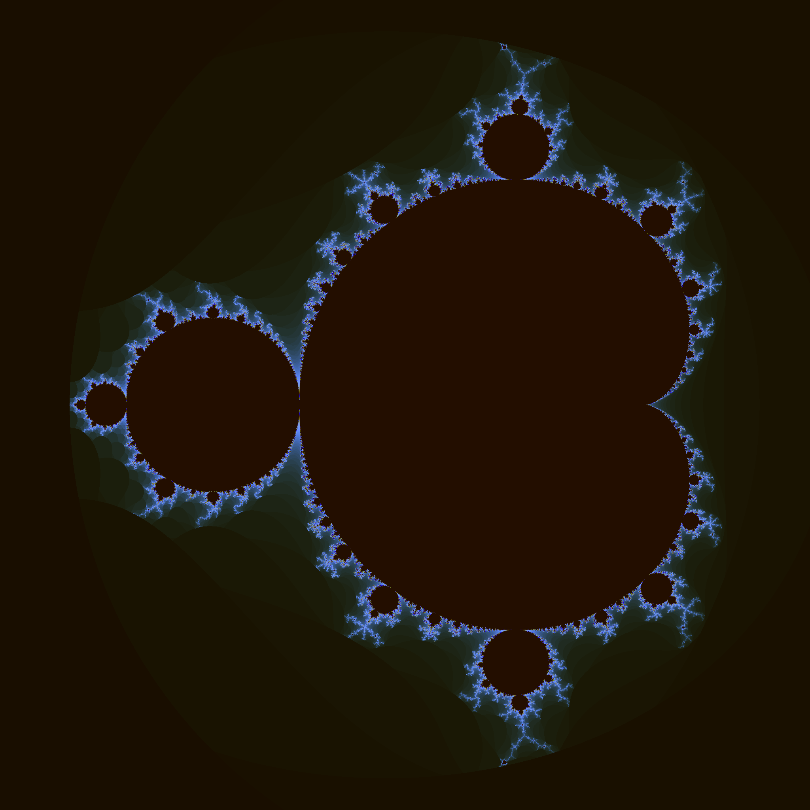

# Vulkan Minimal Compute Async

This is a simple demo that demonstrates how to use Vulkan for async compute-compute operations using two queues from different queue families.
For this demo, Vulkan is used to render the Mandelbrot set on the GPU. 

# Demo

The application launches a compute shader that renders the mandelbrot set, by rendering it into a storage buffer. The compute work for image is split into smaller square tiles, which are submitted to different device queues.
The storage buffer is then read from the GPU, and saved as `.bmp`. 

## Building

The project uses CMake, and all dependencies are included, so you
should use CMake to generate a "Visual Studio Solution"/makefile,
and then use that to compile the program. If you then run the program,
a file named `mandelbrot.bmp` should be created. This is a Mandelbrot
set that has been rendered by using Vulkan. 

Example build command:
`mkdir build && cd build && cmake .. -DCMAKE_BUILD_TYPE=Release && make -j 8 && cd ..`

Launch:
`bin/vk_async_compute`

## Troubleshooting

Check if the correct Vulkan device was selected. This demo by default uses device 0 set in *main.cpp*:

`constexpr unsigned deviceId = 0;`

When application is launched it outputs found devices, example:

`FindPhysicalDevice: { 
  device 0, name = NVIDIA GeForce RTX 2070 SUPER
  device 1, name = llvmpipe (LLVM 15.0.7, 256 bits)
}`

If your GPU has some other device id, change the value of `deviceId` variable and recompile.

## Experimenting

Demo parameters such as tile size, image resolution, etc. are set in *shaders\shaderCommon.h*

Uncomment `#define MULTITHREADED_SUBMIT` in *main.cpp* to enable multithreaded command buffers submission.

Another compute program (*shader_varying_work.comp*) in this repo can be used to vary the number of work
in different tiles. This program randomly changes the number of Mandelbrot set iterations in a tile.
